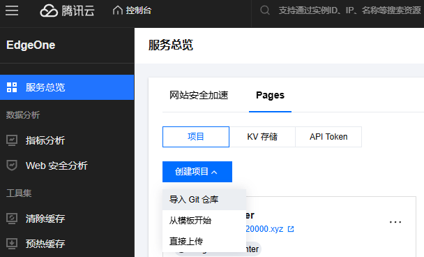
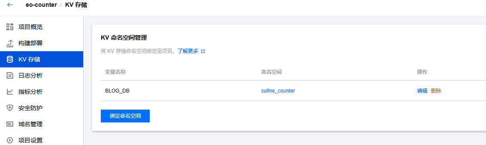
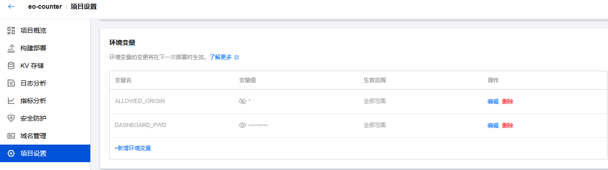
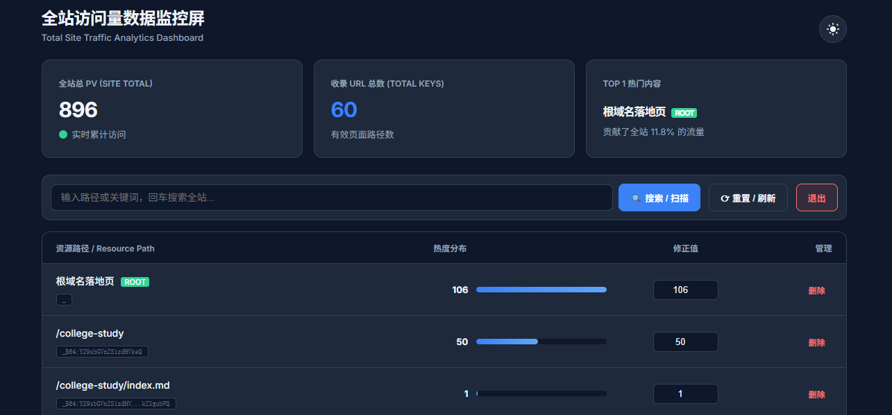

# 📊 EO-Counter 基于 EdgeOne Pages 实现站点访问统计功能

EO-Counter 是一个基于 **腾讯云 EdgeOne Pages 提供的边缘函数与KV存储功能** 构建的轻量级、自托管的博客访问量统计与管理平台。

> **简洁** · **安全** · **免费** · **易于集成**

## 🌟 功能亮点

- **实时全站 PV 统计**：自动记录站点各页面（URL路径）的访问次数，同时维护 `site_total_pv` 全局计数。

- **可视化数据看板**：提供一个**监控大屏**清晰展示总访问量、收录页面数、当前页最热门内容。

- **分页高效加载**：采用游标分页（Cursor-based Pagination），浏览体验流畅。

- **高速后台扫描**：后台静默统计全站页面总数，不影响前台交互。

- **全文路径搜索**：支持关键词模糊搜索，快速定位目标页面。

- **在线数据修正**：可直接在数据看板中修改或删除 PV 数据。

  > 如果删除子页面的统计数据，`site_total_pv` 全局计数数值也会同步扣减。而修改（更新）子页面 PV 时 **不会** 同步调整全局 PV。
  >
  > **为什么这么设计？**
  >
  > - **删除操作**是“移除一条独立记录”，逻辑上应从总数中剔除。
  > - **`site_total_pv` 的设计本意是“全站真实累计访问次数”**，而非“所有子页面 PV 的当前值之和”。
  > - 如果修改（更新）子页面 PV 时想同步调整全局 PV，请手动修正全局 PV 数据。

- **响应式设计与主题切换**：完美适配桌面与移动设备，支持亮色/暗色主题一键切换，保护双眼。

> [!NOTE]
>
> **PV（Page View）**，中文通常译为“**页面浏览量**”或“**页面访问次数**”，是 Web 网站流量分析中最基础、最重要的指标之一。**PV = 用户每次成功加载一个网页，即计为 1 次 PV。**同一用户的刷新操作会更新PV计数值。

## 🛠️快速上手

本项目根据腾讯云 EdgeOne Pages 平台特性设计，提供简化的部署方案。

> 由于Pages KV存储要求KEY值只能为数字、字母、冒号`:`及下划线，所以站点各页面（URL路径）会被编码后存储。
>
> 在可视化监控大屏中，可以看到被还原的 URL 路径，并支持数据修改操作。
>
> 编码方式在本文URL路径编码节中叙述。

### Edgeone 部署操作

1. 注册腾讯云账号并开通 EdgeOne 服务，登录 [EdgeOne Pages 控制台](https://console.cloud.tencent.com/edgeone/pages)

2. 创建 Edgeone Pages 项目

      - 登录腾讯云 EdgeOne 控制台
      - 创建新的 Pages 项目
      - 选择 GitHub 作为代码源
      - 关联（fork）本仓库。或者直接下载本仓库，手动上传到 EdgeOne Pages 里（会自动触发部署）。
      - > 构建设置保持默认即可。

   

3. 配置 KV 存储
   - 在 EdgeOne Pages 控制台创建 KV 命名空间
   - 将 KV 命名空间绑定到项目，变量名设为：`BLOG_DB` （此变量名被程序调用，必须保持完全相同）
     

4. 设置环境变量

   - 环境变量必须配置✅

   - | 环境变量名       | 说明                                                         |
     | ---------------- | ------------------------------------------------------------ |
     | `DASHBOARD_PWD`  | 管理员控制台登录密钥。用于 `api/admin.js` 的身份验证（`X-Auth-Token`）。 |
     | `ALLOWED_ORIGIN` | 允许访问 API 的前端域名（用于 CORS）。例如：https://your-blog.com。建议填写你的博客主站域名。设置变量值为“*”时支持全部域名的跨域访问，可能会导致API被盗刷。本地测试时建议设置为`*`，方便验证。 |
   - ALLOWED_ORIGIN 格式：https://example.com,https://blog.example.com（多个域名用逗号分隔，请勿遗漏`https://`）
   - ALLOWED_ORIGIN 示例场景如下：
      - 场景 1：仅生产环境
          ALLOWED_ORIGIN = https://yourblog.com,https://www.yourblog.com
      - 场景 2：生产环境 + 本地开发
          ALLOWED_ORIGIN = https://yourblog.com,http://localhost:3000
      - 场景 3：完全开放 (仅测试用)
          ALLOWED_ORIGIN = *
   - 
   - > 注意：编辑环境变量后，要使其生效需要在`构建部署`中重新部署项目。

5. 绑定自定义域名，由于 EdgeOne pages 只提供临时测试域名，所以需要绑定自定义域名，并配置SSL证书，开启`https`访问。

6. 部署完成后，你的 EdgeOne Pages 地址即为可视化监控大屏的访问地址。

   
   
   > TOP1 热门内容实际展示的是当前分页中热度最高的内容。出于请求量及加载速度考虑，当前版本代码不会去获取 KV 存储中的全部 URL 路径访问量，而是根据需要读取当前列表中的访问量数据。

### 前端埋点与访问量展示指南

> [!IMPORTANT]
>
> 假设你的 EdgeOne Pages 项目的访问地址为：https://your-eocount.com，则你需要在前端 `js` 代码中设置的 `URL API` 地址为：https://your-eocount.com/api/visit，下文以此域名举例。

假设你的统计服务部署地址为：

```
https://your-eocount.com
```

则对应的统计 API 地址为：

```
https://your-eocount.com/api/visit
```

该 API 支持 CORS，会根据传入的 `url` 参数自动记录并返回：
- **全站总访问量（`total`）**
- **当前页面访问量（`page`）**

#### 一、前端埋点

##### 1. 通用埋点方式（适用于静态博客）

###### 步骤说明

1. **获取当前页面路径**  
   使用 `window.location.pathname` 获取不带域名和查询参数的路径。

   ```js
   const currentPath = window.location.pathname;
   // 示例：https://example.com/posts/hello → "/posts/hello"
   ```

2. **构造请求 URL**  
   将路径作为 `url` 参数传给统计 API：

   ```js
   const apiUrl = `https://your-eocount.com/api/visit?url=${encodeURIComponent(currentPath)}`;
   ```

   > ⚠️ **务必使用 `encodeURIComponent`** 处理路径中可能包含的特殊字符（如 `/`, `-`, 中文等）。

3. **发送埋点请求**

   ```js
   function trackPageView() {
     const path = window.location.pathname;
     const url = `https://your-eocount.com/api/visit?url=${encodeURIComponent(path)}`;

     fetch(url, { method: 'GET' })
       .then(res => {
         if (res.ok) console.log('✅ PV tracked');
       })
       .catch(err => {
         console.warn('⚠️ Failed to track PV:', err);
       });
   }
   ```

4. **在页面加载时执行**

   ```html
   <script>
     document.addEventListener('DOMContentLoaded', trackPageView);
   </script>
   ```

   或直接在 `<body>` 底部：

   ```html
   <script>trackPageView();</script>
   ```

##### 2. 单页应用（SPA）专用：监听路由变化

###### Vue Router（Vue 2/3）

```js
// main.js 或 router.js
router.afterEach((to) => {
  const url = `https://your-eocount.com/api/visit?url=${encodeURIComponent(to.path)}`;
  fetch(url).catch(() => {});
});
```

###### React Router（v5/v6）

```jsx
import { useEffect } from 'react';
import { useLocation } from 'react-router-dom';

function usePageTracking() {
  const location = useLocation();

  useEffect(() => {
    const url = `https://your-eocount.com/api/visit?url=${encodeURIComponent(location.pathname)}`;
    fetch(url).catch(() => {});
  }, [location.pathname]);
}

// 在 App 组件中调用
function App() {
  usePageTracking();
  return <Routes>{/* ... */}</Routes>;
}
```

##### 3. 注意事项

| 项目             | 说明                                                         |
| ---------------- | ------------------------------------------------------------ |
| **CORS 配置**    | 后端需配置 `ALLOWED_ORIGIN` 为你的站点域名（如 `https://yourblog.com`）。开发时可临时设为 `*`。 |
| **避免重复埋点** | SPA 中仅在路由切换后触发一次；静态页面无需额外处理。         |
| **性能影响**     | `fetch` 为异步非阻塞请求，不影响页面加载。                   |
| **HTTPS 要求**   | 生产环境必须使用 HTTPS，否则浏览器可能拦截请求。             |

#### 二、展示访问量数据

##### 1. 基本思路

API 成功响应后返回 JSON：

```json
{
  "total": 12345,
  "page": 678
}
```

- `total`：全站总访问量（`site_total_pv`）
- `page`：当前页面访问量（基于编码后的 URL key）

前端需：
1. 发送请求（同时完成埋点）
2. 解析返回数据
3. 更新 DOM

##### 2. 静态站点实现示例

###### HTML 占位

```html
<div id="pv-stats" style="font-size: 0.9em; color: #666;">
  正在加载访问数据...
</div>
```

###### JavaScript 渲染

```html
<script>
  async function displayPageViews() {
    const path = window.location.pathname;
    const apiUrl = `https://your-eocount.com/api/visit?url=${encodeURIComponent(path)}`;

    try {
      const response = await fetch(apiUrl);
      if (!response.ok) throw new Error('Network response was not ok');

      const { total, page } = await response.json();
      const format = (n) => new Intl.NumberFormat().format(n);

      document.getElementById('pv-stats').innerHTML = 
        `本站总访问量：<strong>${format(total)}</strong> 次<br>
         本文阅读量：<strong>${format(page)}</strong> 次`;
    } catch (err) {
      console.warn('⚠️ 无法加载访问量数据:', err);
      document.getElementById('pv-stats').innerHTML = '访问量统计暂时不可用';
    }
  }

  if (document.readyState === 'loading') {
    document.addEventListener('DOMContentLoaded', displayPageViews);
  } else {
    displayPageViews();
  }
</script>
```

> ✅ **特点**：
> - 自动千位分隔（如 `12,345`）
> - 错误降级友好
> - 与埋点一体化（每次访问都计数并展示最新值）

##### 3. SPA 中展示（以 React 为例）

```jsx
import { useEffect, useState } from 'react';
import { useLocation } from 'react-router-dom';

function PVStats() {
  const [stats, setStats] = useState({ total: 0, page: 0 });
  const [loading, setLoading] = useState(true);
  const location = useLocation();

  useEffect(() => {
    const loadPV = async () => {
      setLoading(true);
      try {
        const res = await fetch(`https://your-eocount.com/api/visit?url=${encodeURIComponent(location.pathname)}`);
        const data = await res.json();
        setStats(data);
      } catch (err) {
        console.warn(err);
      } finally {
        setLoading(false);
      }
    };
    loadPV();
  }, [location.pathname]);

  if (loading) return <div>加载中...</div>;

  return (
    <div>
      全站访问：<strong>{stats.total.toLocaleString()}</strong> 次<br />
      本页访问：<strong>{stats.page.toLocaleString()}</strong> 次
    </div>
  );
}
```

> Vue 用户可参考类似逻辑，结合 `onMounted` 和 `watch(route.path, ...)` 实现。

#### 三、完整部署建议

- **嵌入位置**：将脚本放入博客模板的 `footer` 或 `layout` 文件中，确保全站生效。
- **调试方法**：打开浏览器 DevTools → Network → 查看 `https://your-eocount.com/api/visit` 请求及返回数据。
- **域名替换**：请将所有示例中的 `https://your-eocount.com` 替换为你实际的 EdgeOne Pages 统计服务地址。

#### 四、效果预览

> **本站总访问量：12,345 次**  
> **本文阅读量：678 次**

✅ 通过以上配置，你的站点将具备**自动埋点 + 实时展示访问量**的能力，无需额外数据库或第三方服务，轻量、安全、可控。


### Mkdocs/Zensical 站点引入EO-Counter

关于本节内容请参考我的[个人博客](https://sufine.top)。

如果你的站点采用 `Mkdocs-material / Zensical` 架构，请新建一个 `count.js` 文件，在`mkdocs.yml`、`zensical.toml` 中配置引入该 `js` 文件。

```js
// 网站计数器，PV统计
(function() {
  // === Edge one Pages API 地址📝===
  const WORKER_URL = "https://your-blog.com/api/visit";

  function fetchStats() {
    // 如果是本地预览 (localhost)，不发送请求，避免污染数据
    //if (window.location.hostname === "localhost") {
    //  return;
    //}
    // 获取显示数字的元素
    const siteElem = document.getElementById("site_pv");
    const pageElem = document.getElementById("page_pv");

    // 如果页面上找不到这两个元素（比如还没加载完），就不执行
    if (!siteElem || !pageElem) return;

    // 获取当前路径
    const currentPath = window.location.pathname;

    // 发送请求
    fetch(`${WORKER_URL}/?url=${encodeURIComponent(currentPath)}`)
      .then(response => response.json())
      .then(data => {
        // 更新页面数字
        siteElem.innerText = data.total;
        pageElem.innerText = data.page;
      })
      .catch(err => {
        console.error("访问统计出错:", err);
        // 出错时可以显示 "--" 或者隐藏
        siteElem.innerText = "--";
        pageElem.innerText = "--";
      });
  }

  // === 关键逻辑：处理 MkDocs Material/Zensical 的加载机制 ===
  
  // 检查是否支持 Instant Loading (MkDocs Material 特性)
  if (typeof document$ !== "undefined") {
    // 如果开启了 Instant Loading，RxJS 的 document$ 会负责监听所有跳转（包括首次加载）
    document$.subscribe(function() {
      // 这里的 setTimeout 是必须的，等待页面 DOM 替换完成
      setTimeout(fetchStats, 100);
    });
  } else {
    // 如果没有开启 Instant Loading，则回退到标准的 DOMContentLoaded
    document.addEventListener("DOMContentLoaded", fetchStats);
  }
})();
```

在站点合适的文件内，添加以下`html`代码：

```html
<!-- Site Visits -->
	<style>
    .site-visit-count {
     	padding: 0 12px;
        display: flex;
        justify-content: center;
        align-items: center;
        font-size: 0.65rem;
        color: var(--md-default-fg-color);
    }
    </style>
    <div class="site-visit-count">
      本站访问量：<span id="site_pv">--</span>&nbsp;| 当前页浏览量：<span id="page_pv">--</span>
    </div>
```

## 📌 技术架构

| 组件 | 技术 |
|------|------|
| **前端** | Vue 3 + 原生 CSS（无框架） |
| **后端 API** | EdgeOne Pages 提供的 edge-functions 边缘云函数功能 |
| **存储** | Pages KV（Key-Value）数据库（通过 `BLOG_DB` 绑定） |
| **部署** | 腾讯云 EdgeOne Pages（静态资源） + Edge Function（API） |

## 📁 项目结构

```bash
eo-counter/
├── index.html                 # 主控制台页面(可视化监控大屏)
├── api/
│   ├── admin.js               # 后台管理 API（列表、更新、删除）
│   └── visit.js               # 访问统计 API（接收前端埋点）
└── README.md
```

## 🔐 安全机制

- **管理员鉴权**：所有 `api/admin.js` 接口需携带 `X-Auth-Token` 请求头，值为 `DASHBOARD_PWD` 环境变量。
- **CORS 控制**：通过 `ALLOWED_ORIGIN` 限制前端域名来源，防止数据被盗刷。
- **只读分离**：`visit.js` 仅接受 GET 请求，无权限修改数据；`admin.js` 需认证才能写入。

## 🔄 URL路径编码

KV 中存储的数据格式如下：

| Key（示例） | Value（示例） | 说明 |
|------------|--------------|------|
| `site_total_pv` | `12580` | 全站总访问量（系统保留） |
| `_posts_my-article` | `328` | 明文路径：`/posts/my-article` |
| `_B64:5L2g5aW9...` | `105` | Base64 编码路径（含中文、特殊字符等） |

> 🔍 路径编码规则：
> - 路径分隔符`/`被编码为下划线`_`，并按照路径分隔符进行分段。
> - 仅含字母数字的段保持明文（如 `about` → `about`）。
> - 含特殊字符（如中文、空格、`-` 等）的段使用 Base64 编码并前缀 `B64:`。

## 📝 版本信息

- **当前版本**：v1.0.0 正式版
- **部署环境**：腾讯云 EdgeOne Pages
- **开源协议**：MIT
> Made with ❤️ for developers who care about their blog data.  
> 控制台前端与 API 均为纯静态/无状态设计，可安全部署于边缘网络。